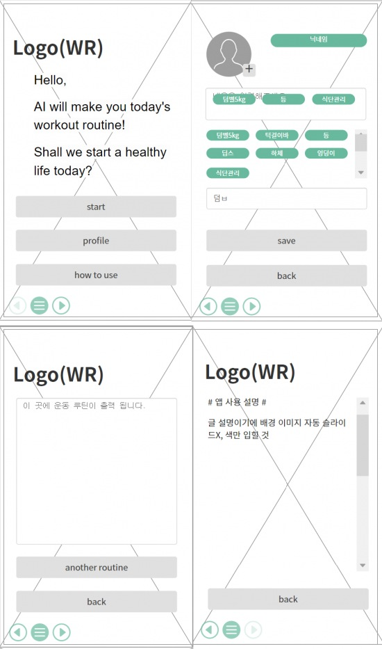

# 1stProject
# WR(Workout Recommend)
- 운동 초보자를 위한 홈트레이닝 루틴 추천 웹서비스
## 1. 목표와 기능
### 1.1 목표
- 운동에 부담감이 있거나, 스스로 루틴을 정하기 힘든 초심자들이 집에서 하는 간단한 운동에 접근성을 낮추기 위함
- 유튜브 홈트레이닝 콘텐츠가 대량으로 제공되고 있으나, 초보자들의 경우 운동을 따라하기보다는 유튜브 시청만 하게 되는 경우가 잦아, 운동으로 유도
- 동일한 운동 루틴을 제공하는 기존 유료 홈트레이닝 앱 서비스와의 차별화로 궁극적으로 사용자가 지루할 틈 없이 운동에 성취감을 얻게 하기 위함
### 1.2 기능
- ChatGPT API 연동으로 홈트레이닝 루틴 추천
- 개개인이 집에 구비되어 있는 장비(ex. 기구없음, 아령''kg, 푸쉬업바, 풀업바 등) 유무를 프롬포트로 넘겨 받아 맞춤 운동 루틴 조정
- (미정)식단 및 체중 기록으로 보다 쉬운 건강관리
## 2. 개발 환경 및 배포 URL
### 2.1 개발환경
- VSCode
### 2.2 배포 URL
- https://github.com/ChoSangYeon/1stProject.git
## 3. 프로젝트 구조와 개발 일정
### 3.1 프로젝트 구조
- 
- 
- https://mm.tt/app/map/2923105017?t=3jPE3sXYZg
 - 마인드맵: MindMeister
### 3.2 개발 일정(WBS)
- 2023-08-30 ~ 2023-09-06
## 4. UI / BM
- 아래 페이지별 상세 설명, 더 큰 이미지로 하나하나씩 설명 필요
- 가능하면 움직이는 gif로 실행되는 것을 추천