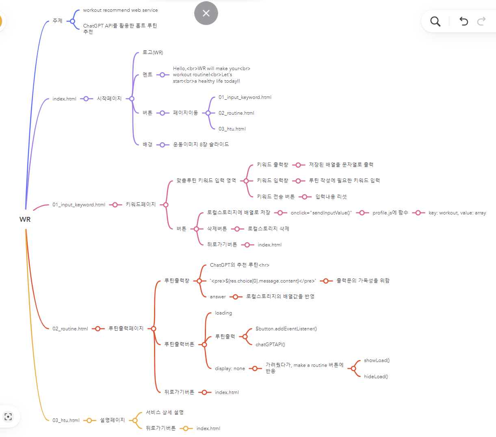

# 1stProject
# WR(Workout Recommend)
- 운동 초보자를 위한 홈트레이닝 루틴 추천 웹서비스
## 1. 목표와 기능
### 1.1 목표
- 홈 트레이닝으로 사용자들의 건강을 도모한다.
- 스스로 운동 루틴을 정하기 힘든 초보자들 및 집에서 어떤 운동을 해야할 지 모르겠는 사람들을 위한 서비스을 제공한다.
- 입력 키워드에 따라 새로워지는 루틴을 받으며 운동에 흥미를 잃지 않을 수 있도록 한다.
### 1.2 기능
- ChatGPT API 연동으로 홈트레이닝 루틴 추천
- 개개인이 집에 구비되어 있는 장비(ex. 기구없음, 아령''kg, 푸쉬업바, 풀업바 등)나 원하는 운동부위(ex. 가슴, 등, 하체 등)를 저장하면 이에 저장된 정보에 맞춤 운동 루틴 조정

## 2. 개발 환경 및 배포 URL
### 2.1 개발환경
- HTML/CSS/JavaScript
- VSCode
### 2.2 배포 URL
- https://chosangyeon.github.io/1stProject/

## 3. 프로젝트 구조와 개발 일정
### 3.1 프로젝트 구조
- 초기 도안 작성
- 4개의 페이지 구성, 메인 페이지, 입력페이지, 출력 페이지, 설명 페이지
- oven: https://ovenapp.io/project/iEJeDlLhAzj9XAIXVrW25HZ5mgEwaqvH#BghWG

- 마인드맵
- MindMeister: https://www.mindmeister.com/app/map/2930201760

### 3.2 개발 일정(WBS)
- 2023-08-30 ~ 2023-09-06

## 4. UI
### 4.1 서비스 사용 설명 페이지를 제외한 모든 페이지들은 배경 이미지 슬라이드가 적용됩니다. 
 
- 서비스 사용 설명 페이지의 경우 문단이 길어 화면 전환이 잦으면, 사용자의 가독성이 떨어질 것을 방지하기 위해 배경 이미지 하나만 넣었습니다.
- 루틴 출력 페이지의 경우는 루틴 출력에 걸리는 대기 시간에 지루함 방지를 위해서 전환 효과를 주었습니다.
- 서비스의 주된 사용자가 운동 초보자임을 가정하였을 때, 루틴을 전부 암기하기보다는 한 가지 동작을 수행하고 다시 화면을 볼 것을 가정하였고, 사용자가 서비스 이용 중 가장 오래 볼 페이지인 루틴 출력 페이지이기에 서비스 자체가 동적인 느낌을 받을 수 있도록 의도하였습니다. 
### 4.2 "start", "profile", "how to use", "back" 버튼 클릭으로 페이지 전환이 가능합니다. 
 
- 기본적인 페이지의 디자인과 구성을 최대한 통일하여 배경 이미지 전환을 더욱 강조하였습니다.
- "how to use" 페이지에서 사용자가 WR이라는 웹 서비스에 대한 상세 설명을 확인 할 수 있습니다.

### 4.3 "profile" 페이지에서 홈 트레이닝 루틴을 추천 받기 위한 키워드를 입력하고 "save" 버튼 클릭을 통해 키워드를 저장할 수 있습니다. 
 
- "루틴 추천 키워드" 입력란에 운동하고 싶은 부위, 방식, 혹은 소지하고 있는 운동기구를 입력하고 "+" 버튼으로 하나씩 배열로 만들어 출력합니다. 사용자에게는 다시 문자열로 바꾸어 입력한 키워드를 확인할 수 있습니다.

### 4.4 "save" 버튼을 클릭하면 입력된 키워드가 로컬스토리지에 저장됩니다. 
 
- 키워드 입력이 완료 되었다면, "save" 버튼으로 키워드 저장이 가능합니다.
- 키워드는 로컬스토리지에 {key: "workout", value: "입력한 키워드의 배열"}로 저장됩니다.
- 다른 키워드가 필요하다면 새로 키워드를 입력하고 다시 "save" 버튼을 클릭하면 기존이 value값을 지우고 새로운 입력값으로 value를 변경합니다.

### 4.5 "start" 페이지에서 "make a routine" 버튼을 클릭하면 로컬스토리지에 저장된 키워드를 추출하여 루틴을 생성합니다. 생성하는 동안 "WR이 출력 중입니다"라는 로딩 메세지가 화면에 나타납니다. 
 
- "start" 페이지에서 "make a routine" 버튼을 클릭하면 로컬스토리지에 저장된 value값을 바탕으로 홈 트레이닝 루틴을 추출합니다.
- 출력문을 작성하는 동안 "ChatGPT의 추천 루틴" 박스에 회전하는 로딩 표시와 메세지가 나타납니다.
- 로딩 표시와 메세지는 "make a routine" 버튼으로 동작하며, 출력문이 완료되면 다시 사라집니다. 

### 4.6 로딩이 완료되면 로딩 메세지는 사라지고 키워드를 바탕으로 홈 트레이닝 루틴이 출력됩니다. 
 
- 출력이 완료되면 로딩 표시와 메세지는 사라지고, 추천 홈 트레이닝 루틴을 작성하여 사용자에게 보여줍니다.
- 각 루틴 별 동작 설명, 세트 수를 줄바꿈 처리로 구분하여 출력합니다.
- 추천 루틴을 받았지만, 동일한 키워드로 다른 루틴을 원할 경우 "make a routine" 버튼을 다시 클릭하면 로딩 표시와 메세지가 다시 나타나며, 새로운 추천 루틴을 출력합니다.

## 5. 후기
- 첫 개인 프로젝트를 진행하면서, 앞서 배웠던 HMTL, CSS, JS를 적용해 볼 수 있는 좋은 기회였습니다. 마무리된 작업물을 볼 때, '저건 왜 그렇게 했지...?' 하면서 구현하는 실력은 물론 기획을 하는 방향에서도 많이 미흡하지 않았나 싶습니다. 하지만 기간 내에 마무리한 점, 간단한 구현이었지만 처음 기획 의도 맞춰 실현해냈다는 점에 대해 이 프로젝트를 시작으로 앞으로 더욱 성장하기 위한 원동력이 되었음 좋겠습니다.